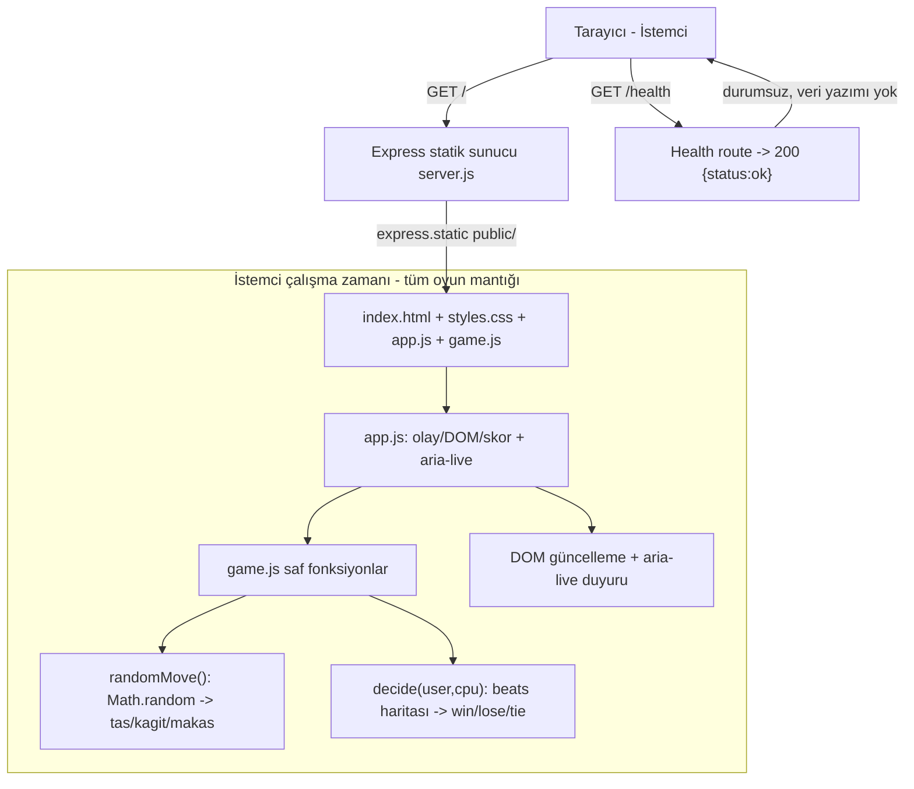
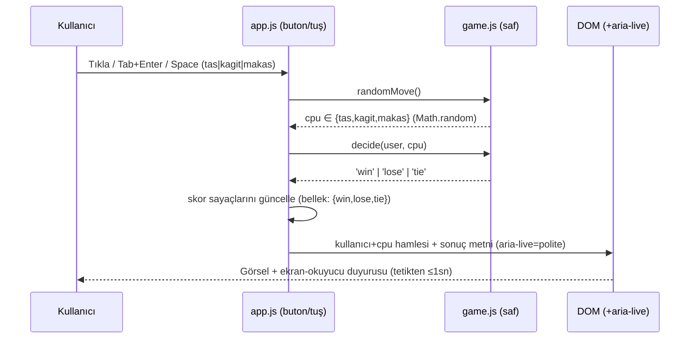

# 05 — Mimari Tasarım: tas-kag-t-makas-oyunu-yap

- Tarih: 2026-07-19 | Mod: AUTOPILOT | Profil: LITE

Girdi: `docs/03-requirements.md` (FR-1..6, NFR-1..8), `docs/04-solution-analysis.md` + `decisions/DL-04-001.md` (Express `express.static`+`/health` · istemci `Math.random()` · açık kazanç haritası saf fonksiyon · framework-suz vanilla JS). Bu faz o dört seçimi somut bileşen/veri-akışı/dosya yapısına döker. Belirleyici NFR'ler: NFR-1 (≤1sn), NFR-2 (≤200KB), NFR-5 (erişilebilirlik), NFR-7 (imaj ≤150MB).

## Bileşen görünümü

Sunucu YALNIZ statik dosya + `/health` servis eder; hamle üretimi ve kural değerlendirme tamamen istemcide (`game.js`). Durumsuz — DB/dosya/log/localStorage/çerez yazımı yok (FR-4, FR-5, NFR-3).

## Veri akışı

Ağ gidiş-dönüşü yok → NFR-1 tetiklemeden sonuca senkron, tek makro-görev içinde tamamlanır.

## Veri modeli
Kalıcı veri YOK (FR-4, NFR-3). Tek geçici çalışma-zamanı durumu (yalnız bellekte, sayfa yenilenince sıfırlanır):
- `score: { win: number, lose: number, tie: number }` — oturum-içi sayaç.
- `lastRound: { user, cpu, result } | null` — yalnız render için son tur.
Sunucu tarafı durum: **yok** (stateless). Depolama katmanı: **yok**.

## Teknoloji seçimleri
| Katman | Seçim | Alternatifler | DL referansı |
|--------|-------|---------------|--------------|
| Sunucu | Node 20 + Express (`express.static` + `/health`) | çıplak http+fs; nginx | DL-04-001 |
| Rastgelelik | İstemci `Math.random()` (`randomMove()`) | sunucu API; crypto.getRandomValues | DL-04-001 |
| Kural motoru | Açık kazanç haritası `{tas:'makas',kagit:'tas',makas:'kagit'}` saf `decide()` | modüler aritmetik; iç içe if | DL-04-001 |
| İstemci yığını | Framework-suz vanilla JS + HTML/CSS (build yok) | Preact+htm; React+Vite | DL-04-001 |
| Paketleme | `node:20-alpine` tek-aşama imaj | çok-aşamalı build | DL-05-001 |
| Test | Node yerleşik `--test` (9 kombinasyon + dağılım) + supertest (`/health`) | Jest/Vitest | DL-05-001 |

## Dizin yapısı (hedef)
```
server.js                 # Express: express.static('public') + GET /health
public/
  index.html              # tek ekran: 3 <button> + skor + aria-live sonuç bölgesi
  styles.css              # sade tema; kontrast ≥4.5:1; responsive ≥360px
  app.js                  # olay bağlama, skor state, DOM/aria-live güncelleme
  game.js                 # saf: randomMove() + decide(user,cpu) + beats haritası
tests/
  game.test.js            # 9 kombinasyon %100 + 3000 turluk dağılım ~%33,3 ±%5
  health.test.js          # supertest GET /health -> 200 {status:"ok"}
Dockerfile                # node:20-alpine tek-aşama, npm ci --omit=dev
package.json              # express (prod); supertest (dev); "test":"node --test"
```
`game.js` istemci ESM olarak da, Node test koşucusunda da import edilir (izole saf fonksiyonlar → FR-2/FR-3 birebir test edilir).

## NFR ↔ Mimari eşlemesi (kalite kapısı kanıtı)
| NFR | Kritik? | Mimarideki somut karşılığı |
|-----|---------|-----------------------------|
| NFR-1 (≤1sn gecikme) | ★ | İstemci RNG + saf `decide()` senkron; ağ yok; sonuç aynı olay döngüsü turunda DOM'a yazılır — CSS geçişi ≤300ms sabiti (`prefers-reduced-motion` fallback) ile ölçülebilir üst sınır |
| NFR-2 (≤200KB) | ★ | Kütüphanesiz istemci; 4 küçük statik dosya (html+css+app.js+game.js) toplam birkaç KB; bundler/framework/font/görsel bağımlılığı yok — Express yalnız sunucuda (imaja girer, sayfa boyutuna değil) |
| NFR-3 (asgari yüzey) | | Yalnız 2 GET route (`/`, `/health`); girdi alanı/DB/dosya-yazımı/log yok → XSS/SQLi yüzeyi yok; tek denetlenen bağımlılık `express`; `npm audit` CI kapısı (NFR-3/FR-5) |
| NFR-4 (HTTPS) | | Deploy katmanı: nginx + wildcard TLS (`tas-kag-t-makas-oyunu-yap.apps.sametemek.com`), HTTP→HTTPS; uygulama katmanı deploy-agnostik (coinflip/dice-game SSH-push kalıbı) |
| NFR-5 (erişilebilirlik) | ★ | Semantik `<button>` (Tab/Enter/Space doğal, FR-1); sonuç `aria-live="polite"` bölgesinde duyurulur (FR-3); kontrast ≥4.5:1 palet; skor sayaçları metinsel; `prefers-reduced-motion` |
| NFR-6 (tarayıcı uyumu) | | Standart DOM/CSS + ES modülleri; deneysel/WebGL API yok; responsive ≥360px viewport |
| NFR-7 (imaj ≤150MB, build ≤15dk) | ★ | `node:20-alpine` (~50-75MB) tek-aşama; `npm ci --omit=dev` (supertest imaja girmez) + `COPY public server.js` → dakikalar içinde build |
| NFR-8 (health %100) | | Ayrı `/health` route sabit `{status:"ok"}` döndürür (durumdan bağımsız); `health.test.js` (supertest) + CI smoke testi doğrular |

## ADR listesi
- DL-04-001: Mimari yaklaşım (Express + istemci Math.random + kazanç haritası + vanilla JS) — Faz 4.
- DL-05-001: İmaj + test yığını — `node:20-alpine` tek-aşama + Node `--test`/supertest; `game.js`'i istemci-ESM ↔ test-import ortak modülü olarak konumlandırma.

## Kalite kapısı raporu
- "Kritik NFR'lerin mimaride karşılığı var" → ✅ GEÇTİ — NFR-1..NFR-8'in her biri yukarıdaki eşleme tablosunda somut bir mekanizmaya bağlandı; belirleyici NFR-1/2/5/7 (★) doğrudan bileşen/veri-akışı/dosya-yapısı kararlarına (senkron istemci RNG, kütüphanesiz statik dosyalar, `<button>`+`aria-live`, alpine tek-aşama imaj) izlenebilir biçimde karşılandı.
- Yapısal kontrol (elle izlendi; gerçek koşum orchestrator'da): şablon başlıkları (Bileşen/Veri akışı/Veri modeli/Teknoloji/NFR↔Mimari/ADR/Kapı raporu) ✓; ≥1 Mermaid diyagram (2 adet: graph + sequence) ✓; NFR↔Mimari tablosu tüm 8 NFR'yi kapsıyor ✓; DL-05-001 mevcut ✓; DL-04-001 referansı ✓.
