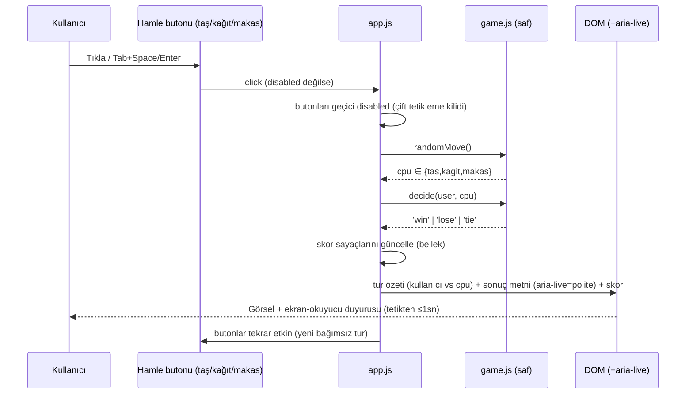

# 06 — UI/UX: tas-kag-t-makas-oyunu-yap

- Tarih: 2026-07-19 | Mod: AUTOPILOT | Profil: LITE
- Ürün tipi: web → tek sayfa (SPA değil; statik HTML + vanilla JS)

Girdi: `docs/03-requirements.md` (FR-1..6, NFR-5), `docs/05-architecture.md` (dizin yapısı: `public/{index.html,styles.css,app.js,game.js}`).

## Yüzey sözleşmesi (tek ekran)
| Öğe | Rol | Etkileşim | İlgili FR/NFR |
|-----|-----|-----------|----------------|
| Başlık `<h1>` "✊✋✌️ Taş Kağıt Makas" | Sayfa kimliği | — | — |
| 3 hamle butonu `<button data-move="tas\|kagit\|makas">` | Hamle seçimi (✊ Taş / ✋ Kağıt / ✌️ Makas) | Click / Tab+Space/Enter; tur işlenirken kısa süre `disabled` | FR-1, NFR-5 |
| Tur alanı `
` (kullanıcı hamlesi vs bilgisayar hamlesi) | Son turun görsel özeti | Her turda güncellenir | FR-3 |
| Sonuç `
` | Ekran-okuyucu duyurusu ("Kazandın! ✊ Taş, ✌️ Makas'ı ezer.") | Otomatik güncellenir | FR-3, NFR-5 |
| Skor `
` (Kazanma / Kaybetme / Berabere sayaçları) | Oturum-içi skor | Her turda artar | FR-4 |
| Alt not `<small>` "Skor yalnız bu oturumda tutulur, yenilemede sıfırlanır" | Stateless beklentisi | — | FR-4 |

Tek oyunculu, tek ekran — hesap/online mod/skor geçmişi kontrolü YOK (FR-6).

## Ana akış — uçtan uca (kalite kapısı)

Klavye akışı: `Tab` ile bir hamle butonuna ulaş → `Space`/`Enter` ile seç → sonuç `aria-live` ile duyurulur (fare gerekmez, NFR-5).

## Çıktı/görsel şablonları
- **Hamle simgeleri:** Unicode emoji (✊ ✋ ✌️) — harici ikon/font bağımlılığı yok (NFR-2).
- **Başlangıç durumu (boş):** Sayfa yüklenince tur alanı boş/nötr, skor 0-0-0, `#result` boş, 3 buton etkin.
- **Tur sırası:** Butonlar kısa süre (≤300ms, `prefers-reduced-motion` ile atlanabilir) soluk/`disabled` — çakışan tetiklemeyi önler; anında (senkron) sonuç hesaplanır.
- **Sonuç metni kalıbı:** "Kazandın! {kullanıcı-emoji} {kullanıcı-adı}, {cpu-emoji} {cpu-adı}'ı {fiil}." / "Kaybettin! ..." / "Berabere! İkiniz de {hamle} seçti."
- **`prefers-reduced-motion: reduce`:** geçiş efekti atlanır, sonuç anında gösterilir (NFR-5) — işlevsellik korunur.
- **Hata/kenar durumları:** Sunucu/ağ hatası oyunu ETKİLEMEZ (mantık istemcide, FR-2/FR-5) — sayfa yüklendiyse oyun çalışır. JS devre dışıysa: `<noscript>` ile "Bu oyun JavaScript gerektirir" mesajı. Geçersiz hamle/sonuç üretilemez (`decide()` yalnız 3 girdi kabul eder, kapsam dışı değer atılır).

## Tasarım notları
- **Palet/kontrast:** Sade/minimal tema (Faz 3 varsayımı — DL-03-001); metin/arka plan kontrastı ≥ 4,5:1 (WCAG 2.1 AA, NFR-5); renk tek başına anlam taşımaz (sonuç metin olarak da duyurulur).
- **Boyut:** Kütüphanesiz; yalnız Unicode emoji + CSS. Toplam sayfa ≤ 200 KB'ın çok altında (NFR-2).
- **Responsive:** ≥360px mobil viewport'ta 3 buton dikey/yatay uyarlanır, dokunma hedefi ≥44px (NFR-6).
- **Ton:** Minimalist; coinflip/dice-game ile görsel tutarlılık.

## Kalite kapısı raporu
- "Ana kullanıcı akışları uçtan uca çizildi" → ✅ GEÇTİ — tek ana akış (hamle seç → hesapla → sonuç+skor+duyuru → tekrar) hem Mermaid hem metinsel klavye akışıyla uçtan uca verildi; başlangıç/tur-sırası/reduced-motion/JS-yok kenar durumları tanımlandı.
