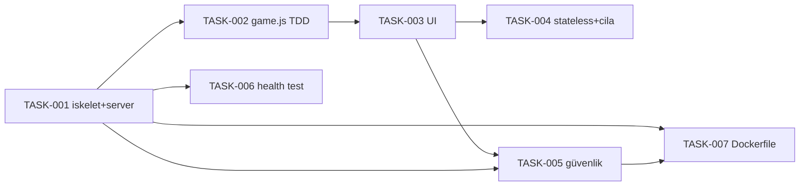

# 08 — Planlama: tas-kag-t-makas-oyunu-yap

- Tarih: 2026-07-19 | Mod: AUTOPILOT | Profil: LITE

Girdi: `docs/03-requirements.md` (FR-1..6, NFR-1..8), `docs/05-architecture.md` (bileşen/dizin yapısı), `docs/07-security.md` (SEC gereksinimleri).
> LITE: tek milestone + önceliklendirilmiş backlog. Task'lar TDD sırasına göre (önce test) yürütülür.

## Milestone'lar
| M | Hedef | Kapsanan FR'ler | Hedef tarih |
|---|-------|-----------------|-------------|
| M1 | Çalışan, test edilmiş, paketlenmiş tas-kag-t-makas-oyunu-yap v1 | FR-1..6, NFR-1..8, SEC-* | Faz 9-12 koşumu |

## Backlog (önceliklendirilmiş, GitHub Issues formatına uyumlu)

### [M1] TASK-001: Proje iskeleti + Express sunucu + /health
- **Tahmin:** ~0.3 gün
- **Bağımlılık:** —
- **FR:** FR-5, NFR-8
- **Kabul:** `server.js` Express ile `/` (`express.static('public')`) ve `/health` (`{"status":"ok"}`) servis eder; `package.json` (express dep, node --test/supertest devDep); `npm start` çalışır.

### [M1] TASK-002: game.js — hamle/kural mantığı (TDD)
- **Tahmin:** ~0.3 gün
- **Bağımlılık:** TASK-001
- **FR:** FR-2, FR-3, FR-6
- **Kabul:** `public/game.js` — `randomMove()` daima {tas,kagit,makas} döner; `decide(user,cpu)` açık kazanç haritasıyla 9 kombinasyonun TAMAMINI doğru çözer. `tests/game.test.js` ÖNCE yazılır (red→green): 9 kombinasyon tam testi + 3000 turluk dağılım testi (~%33,3 ±%5).

### [M1] TASK-003: UI — tek sayfa, 3 hamle butonu, skor, aria-live
- **Tahmin:** ~0.4 gün
- **Bağımlılık:** TASK-002
- **FR:** FR-1, FR-3, FR-4, FR-6, NFR-5
- **Kabul:** `public/{index.html,styles.css,app.js}`; 3 buton click/Space/Enter ile tur başlatır, tur işlenirken kısa `disabled`; sonuç+skor `aria-live`; kontrast ≥4,5:1; `<noscript>` uyarısı; skor yalnız bellekte (FR-4).

### [M1] TASK-004: Stateless doğrulama + boyut/erişilebilirlik cilası
- **Tahmin:** ~0.2 gün
- **Bağımlılık:** TASK-003
- **FR:** FR-4, NFR-1, NFR-2, NFR-6
- **Kabul:** Hiçbir depolama (localStorage/sessionStorage/çerez) kullanılmaz; sayfa yenilemede skor sıfırlanır; toplam sayfa ≤200KB; `prefers-reduced-motion` fallback; ≥360px responsive.

### [M1] TASK-005: Güvenlik sertleştirme (docs/07-security.md SEC gereksinimleri)
- **Tahmin:** ~0.3 gün
- **Bağımlılık:** TASK-001, TASK-003
- **FR:** NFR-3, NFR-4
- **Kabul:** `docs/07-security.md`'de listelenen SEC gereksinimleri (güvenlik header'ları, dotfile reddi, `innerHTML` yerine `textContent`, `.dockerignore`, `npm audit` Critical/High=0) uygulanır.

### [M1] TASK-006: health + statik servis entegrasyon testi
- **Tahmin:** ~0.15 gün
- **Bağımlılık:** TASK-001
- **FR:** FR-5, NFR-8
- **Kabul:** `tests/health.test.js` supertest ile `GET /health`→200 `{status:"ok"}` ve `GET /`→200 HTML; `npm test` yeşil, coverage ≥%70.

### [M1] TASK-007: Dockerfile + .dockerignore (Faz 12 girdisi)
- **Tahmin:** ~0.2 gün
- **Bağımlılık:** TASK-001, TASK-005
- **FR:** NFR-7
- **Kabul:** `node:20-alpine` tek-aşama, `npm ci --omit=dev`, non-root; imaj ≤150MB; `.dockerignore` `.git`/`node_modules`/`tests` hariç tutar.

## Bağımlılık grafı (kalite kapısı: çevrimsiz)

## Kalite kapısı raporu
- "Her task 1 günden küçük" → ✅ GEÇTİ — 7 task'ın her biri ≤0,4 gün tahminli, hepsinde `Tahmin` alanı var.
- "Bağımlılık grafı çevrimsiz" → ✅ GEÇTİ — graf tek yönlü (T1→T2→T3→{T4,T5}, T5→T7); döngü yok, topolojik sıralanabilir.
